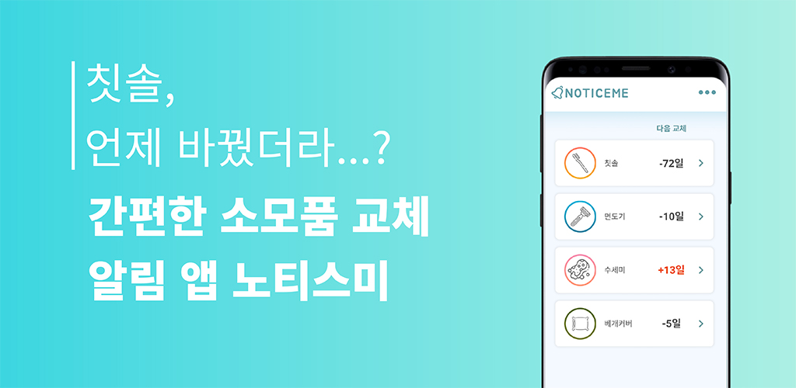
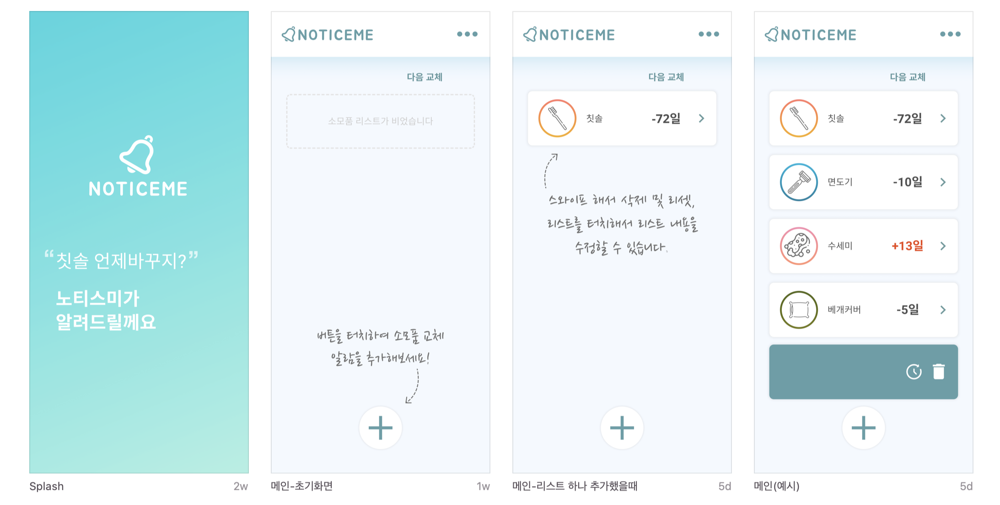
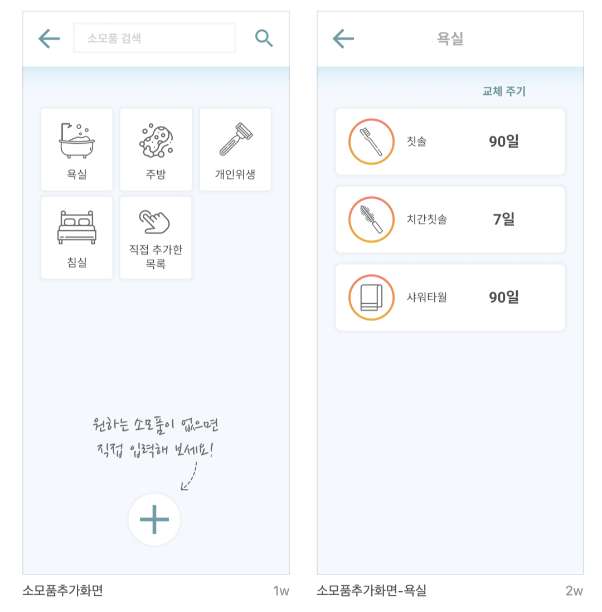
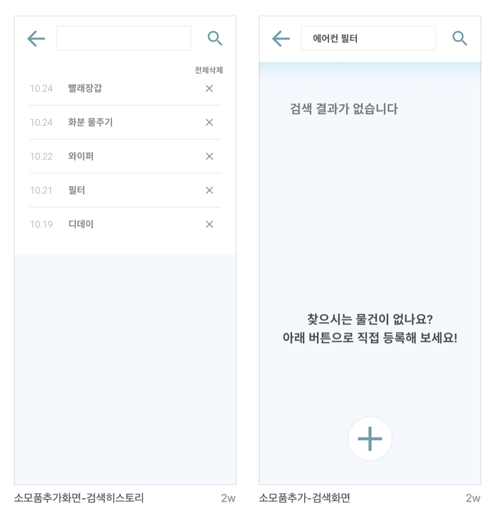

# Noticeme

 

This is android app which informs you of daily routine job at the right time.

## Table of Contents
- [Prerequisite](#prerequisite)

## Prerequisite

- Android 5.0 (API level 21) or later
- Java 1.8
- Kotlin jvmTarget 1.8
- Build Feature
    - viewBinding true
-

## Screemshot

